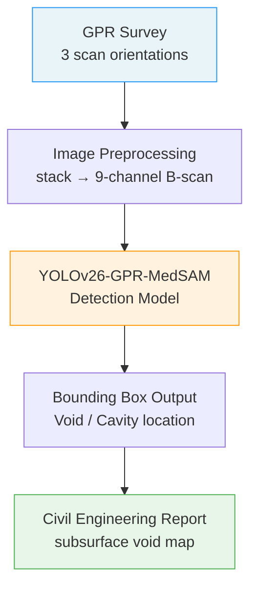
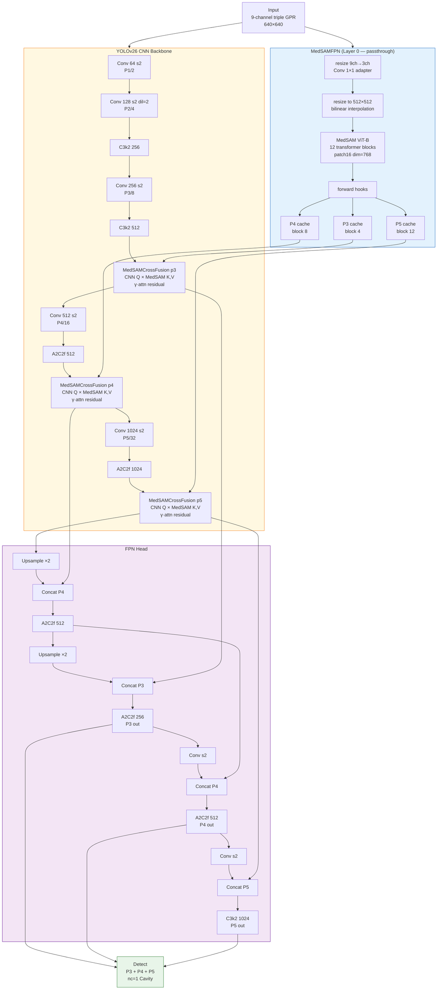
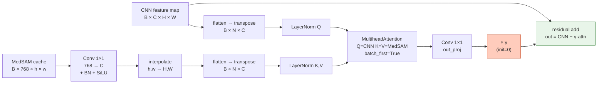
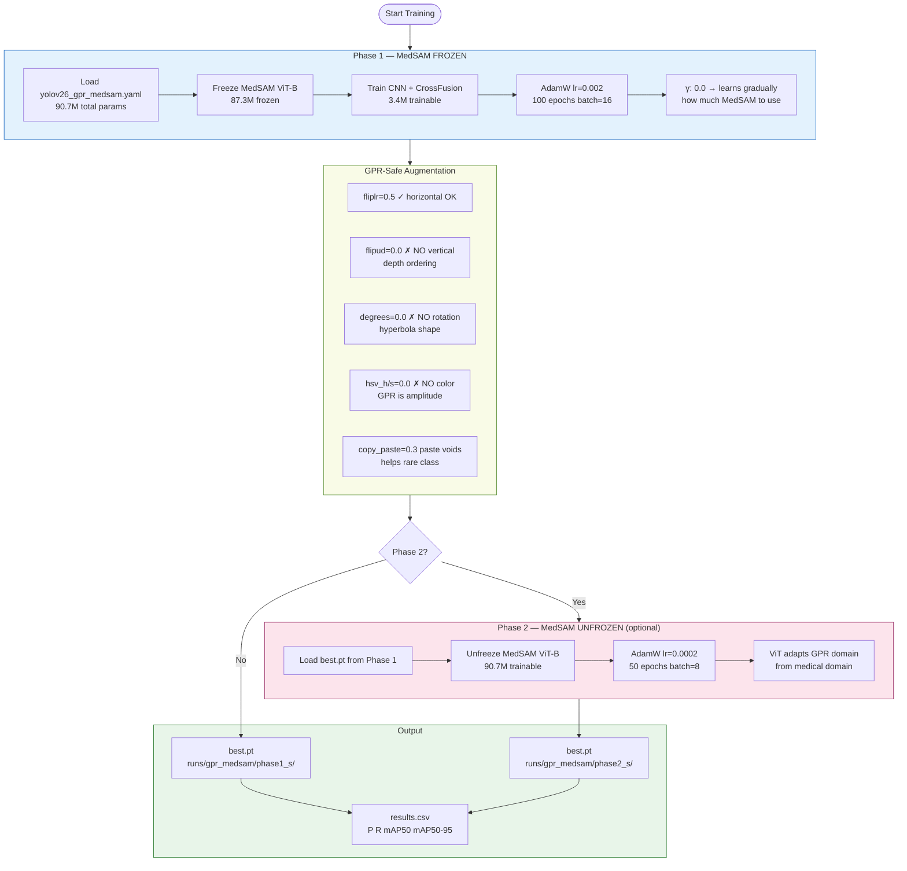
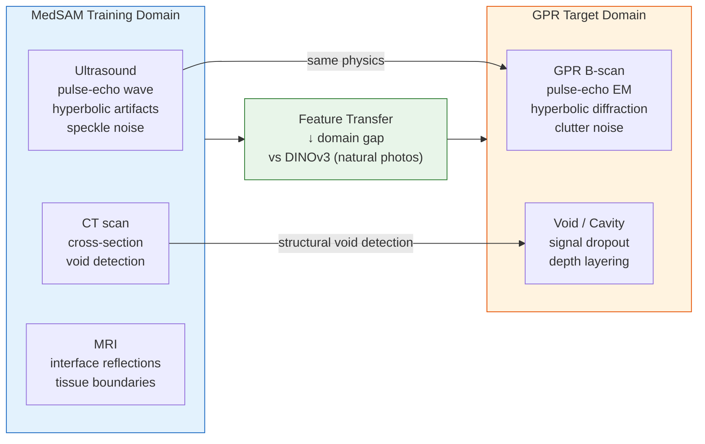

# YOLOv26-GPR-MedSAM — System Flowchart

## 1. Overall Pipeline



---

## 2. Model Architecture



---

## 3. MedSAMCrossFusion Detail



---

## 4. Training Phases



---

## 5. Domain Transfer Rationale



---

## 6. Training Commands

```bash
# Phase 1 only (recommended first run)
python train_medsam.py --scale s --epochs 100 --batch 16

# Phase 1 + Phase 2
python train_medsam.py --scale s --epochs 100 --phase2

# Larger model
python train_medsam.py --scale m --epochs 150 --batch 8 --phase2

# Skip Phase 1, start Phase 2 from checkpoint
python train_medsam.py --weights runs/gpr_medsam/phase1_s/weights/best.pt --phase2

# Compare MedSAM vs DINOv3 (same hyperparams)
python train_medsam.py --compare --scale s --epochs 100
```
